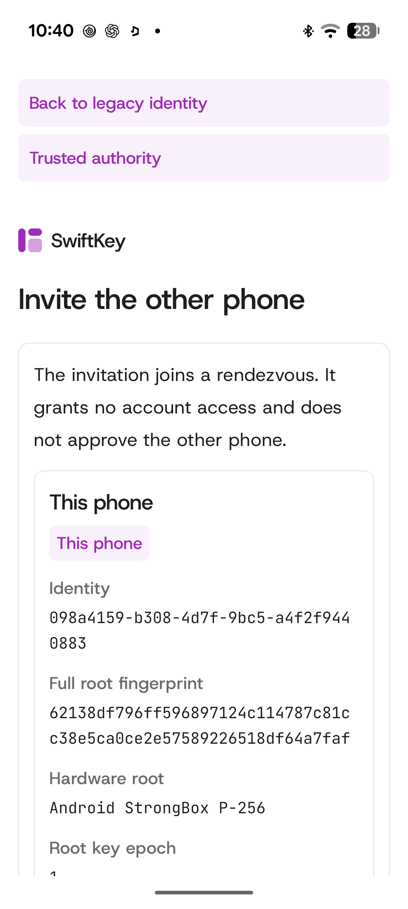

# How this replaces a security key

**SwiftKey is designed to let an Android or iPhone act as a hardware-backed account
key. Android StrongBox works today; iPhone Secure Enclave support is not implemented
yet.** Each compatible Android phone keeps a non-exportable ECDSA P-256 root in
StrongBox. It authorizes a separate P-256 software signing key for a **four-hour
epoch**, without sending either private key to the authority.

Two phones independently own one account. Both compare identities and approve the
same account proposal before the Swift/Vapor authority creates it. Each signs in
separately and receives its own epoch credential; no private key is shared.

SwiftKey is a custom authentication protocol for applications that integrate it,
**not a FIDO2/WebAuthn security key or a drop-in passkey for existing websites**.

## Pairing and trust

Prepare both phones, inspect a short-lived invitation, compare the full root
fingerprints and comparison code, then confirm on both. Scanning or importing
alone grants no ownership. The second matching account approval commits two
owners atomically and returns a signed ledger receipt.

The hardware root stays stable. Software signing keys rotate on demand at fixed
four-hour UTC boundaries and live in private app storage, outside StrongBox.
The separate 15-minute hardware-trust lease requires explicit renewal with the
same root. Online verification checks current membership, trust, expiry and replay
state. Short-lived credentials do not make a compromised phone trustworthy, and
signing does not require a fingerprint, PIN or touch for every request.

Adding or replacing an owner requires a current owner and the new phone to approve.
A surviving owner can recover access, but a compromised owner can also take over.
If all owners are lost, there is no administrative recovery or password reset.

See the [protocol overview and diagrams](docs/protocol.md),
[pairing wire specification](docs/PAIRING-ACCOUNT-PROTOCOL.md) and
[cryptographic protocol](PROTOCOL.md) for the complete flows and trust model.

<p></p>

Pairing preparation captured on a real Pixel during
[hardware verification](artifacts/phone-v2-hardware/README.md); no invitation secret is shown.

## What works today

A real Pixel/Xiaomi run against an isolated Vapor authority passed StrongBox
admission, mutual pairing, account creation and independent sign-ins with verified
epoch credentials, preserving both hardware roots. It used Copy link and manual
import. Optical QR scanning, interrupted ceremonies and replacement still need
physical acceptance. The v2 UI does not expose workload submission.

Standalone revocation, arbitrary policy changes, browser-login grants, legacy
upgrade and iOS remain unavailable. This is a development project, without a
production authority cutover. [Build status](BUILD_STATUS.md) separates tested
behavior from remaining work.

## Get the code and build

Download the [latest Android APK](https://github.com/maceip/Swiftkey/releases/latest).
Branch pushes build versioned ARM64 development APKs with checksums; see
[automatic releases](docs/ANDROID-RELEASES.md) for signing and versioning details.

```sh
git clone https://github.com/maceip/Swiftkey.git
cd Swiftkey
bash scripts/androidswiftui.sh doctor
bash scripts/swiftkey-protocol.sh test
bash scripts/androidswiftui.sh android-build
```

Use `main`; renderer sources are included, with no submodules. `doctor` checks
prerequisites without installing them. Follow [phone setup](docs/PHONE-V2-BUILD.md)
and the [server guide](SwiftKeyServer/README.md). Enabling v2 requires an explicit
authority state-format change; existing legacy accounts are not migrated automatically.

## Code map

| Directory | Responsibility |
| --- | --- |
| [SwiftKeyCore](SwiftKeyCore/README.md) | Records and cryptography |
| [SwiftKeyClient](SwiftKeyClient/Sources/SwiftKeyClient/ProtocolClient.swift) | Durable client and hardware operations |
| [SwiftKeyApplication](SwiftKeyApplication/README.md) | State and service adapters |
| [SwiftKeyUI](SwiftKeyUI/README.md) | Shared phone and webpage views |
| [SwiftKeyServer](SwiftKeyServer/README.md) | Vapor authority and ledger |
| [AndroidSwiftUI](AndroidSwiftUI/README.md) | Compose renderer and Android host |

Web and native views share [design tokens](SwiftKeyDesign/README.md).
The [Cupertino integration](AndroidSwiftUI/docs/cupertino/README.md) includes six
upstream modules, 127 surfaces and 879 icons; [provenance](AndroidSwiftUI/UPSTREAM.md)
is retained. [Optional design research](tools/DesignResearch/README.md) is separate
from authentication and has not been trained on real UI ratings.
