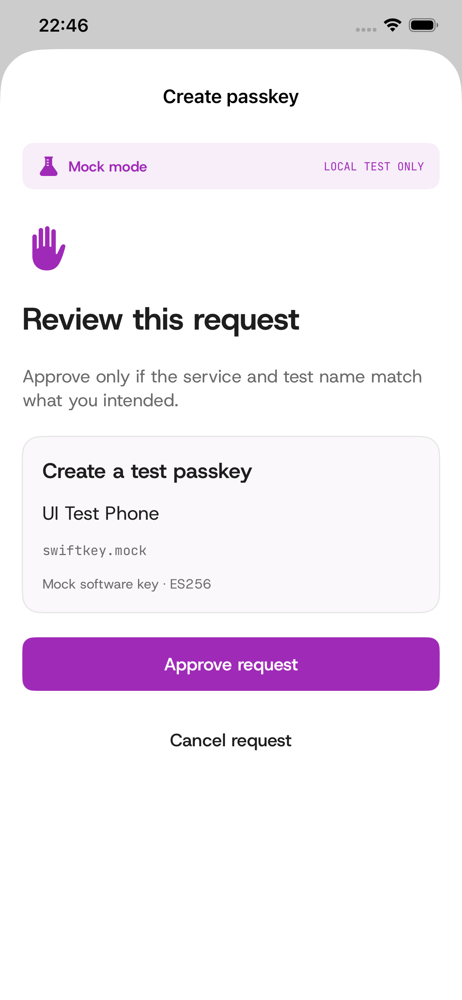
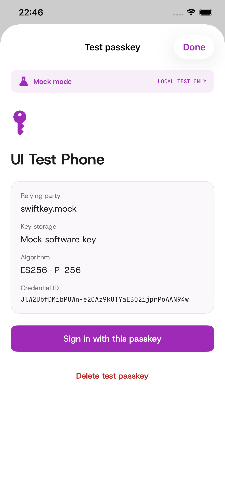
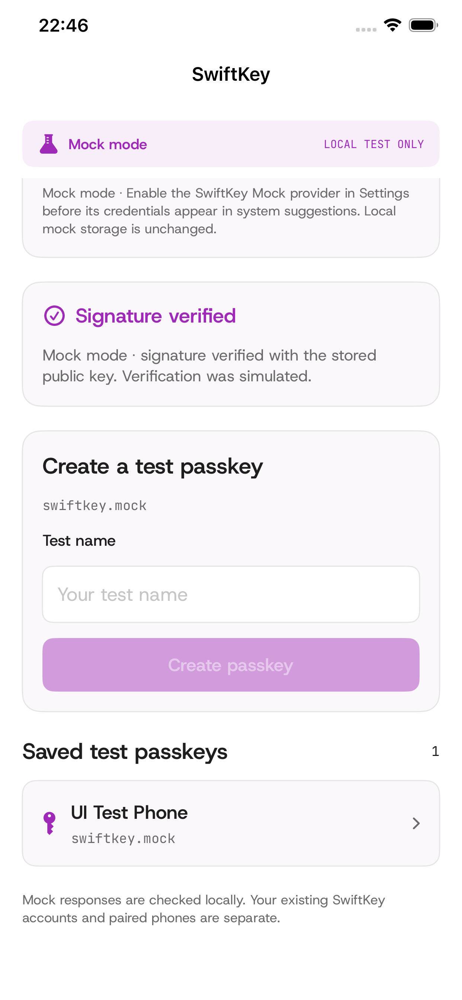

# iOS executable mock verification — 2026-09-21

Native SwiftUI app plus embedded AuthenticationServices credential-provider
extension, built with Xcode 26.4.1 / Swift 6.3.1. The dedicated iOS 26.4 simulator
ran the actual app. These are screenshots of its UI during passing XCTest flows,
not design mockups. All keys are software test keys; user verification is simulated.

| Check | Result |
| --- | --- |
| Debug simulator app and embedded extension | Built, installed and launched |
| Mock engine | 21 host tests passed |
| Shared coordinator/storage | 4 simulator tests passed |
| Apple request/response adapter | 5 simulator tests passed |
| Actual app interaction | 4 UI tests passed |
| Independent SwiftWebAuthn RP verification | 12 focused server tests passed, including the iOS engine fixture |
| Release iPhone app and extension | Unsigned build passed; mock backend disabled |
| Project regeneration / release scripts | Deterministic project; shell syntax and 32 release-script tests passed |

The UI suite creates a credential, signs and verifies a fresh challenge, deletes
it, rejects cancelled/failed verification, and signs with a credential after app
relaunch. The adapter suite instantiates Apple's real request classes; it checks
exact hash/identity binding, approval, persistence, replay rejection and the
requirement for interactive verification. It invokes the extension methods
directly through a simulator test completion callback, not through Safari.

The [test summary](simulator-test-summary.txt) records all 13 simulator test results.
The local result bundle is
`iOS/DerivedData/Logs/SwiftKey/UITests-20260921-224610.xcresult`.
Full local build logs are under `iOS/DerivedData/Logs/SwiftKey/`;
CI uploads fresh logs/results and a simulator `.app` archive on each branch push.
The independent verifier consumes only the
[public iOS fixture](../../SwiftKeyServer/Tests/SwiftKeyPasskeyTestTests/Fixtures/ios-mock-engine.json).

## Captured app screens

 

The [screenshot manifest](screenshots.json) records original test identifiers,
timestamps and file hashes. It contains only disposable test names and public
credential identifiers. No private key or authority state is included.

## Boundaries

Simulator builds are ad-hoc signed, with Xcode's simulated capabilities embedded
in each executable's `__TEXT,__entitlements` section. This and successful app-group
storage do not establish physical-device signing authorization. Release and
physical-device builds cannot activate the mock backend.

No Secure Enclave operation, Face ID, Safari-routed ceremony, production website
credential or real credential-suggestion selection was exercised. The unsigned
iPhone `.app` is a compilation artifact, not an installable IPA. The mock cannot
enroll real RPs: it permits only `swiftkey.mock` and `localhost`.
