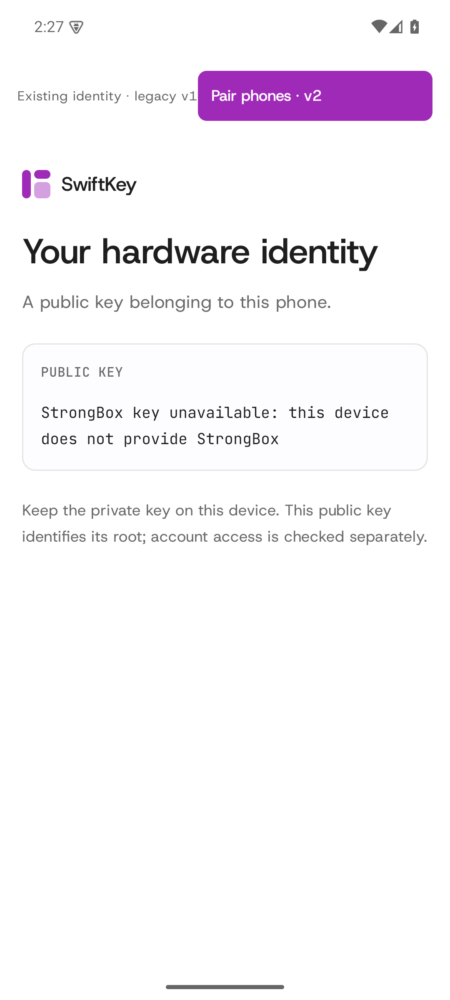
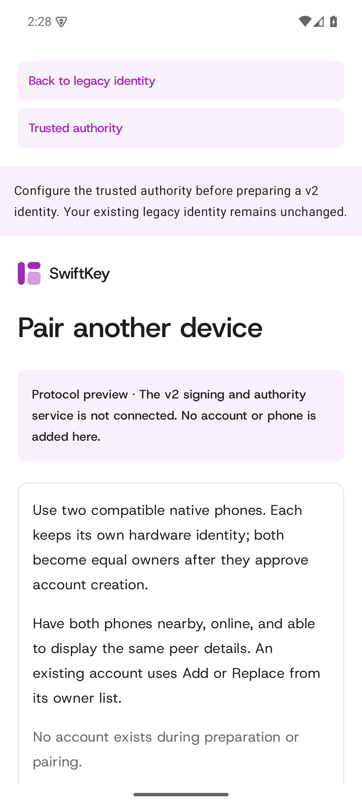

# SwiftKey product UI verification

Verified on 2026-09-21 after removing development-gallery navigation from the
installed Android app. The product target compiles only its entry point,
identity, pairing, and protocol bridge files. The renderer remains available as
a library; its development previews are not exported by the APK.

- Three Android instrumentation tests passed on an isolated API 35 ARM64 emulator:
  normal launch and pairing/back navigation, gallery-style incoming intent and
  extras, and only the product launcher exported.
- 28 shared UI tests passed, including all phone phases and all five workspace
  sections across loading, ready, stale, and failed states.
- 14 component renderer tests, 10 general renderer tests, and eight Android unit
  tests passed. Generic rendering failures display product-safe text.
- The final APK manifest passed the same preview-activity rejection used in CI.
- The two public README screenshots were visually reviewed and checked with
  macOS Vision OCR; they show actual pairing and account-owner screens.

Local APK SHA-256:
`de6a3148e68d77a16e92d5c467bd3805ef157faaf613d19d65cf679a959961d7`.

[Test output](instrumentation-tests.txt), [verification record](verification.json),
[identity hierarchy](identity.xml), and [pairing hierarchy](pairing.xml) record
the executed checks. The temporary emulator was shut down after verification;
existing AVDs and phones were not modified.

These captures verify navigation and visible product UI. This emulator has no
StrongBox and no configured authority, so they do not claim a hardware-backed
pairing or sign-in. The separate [physical-device evidence](../phone-v2-hardware/README.md)
records those ceremonies.

