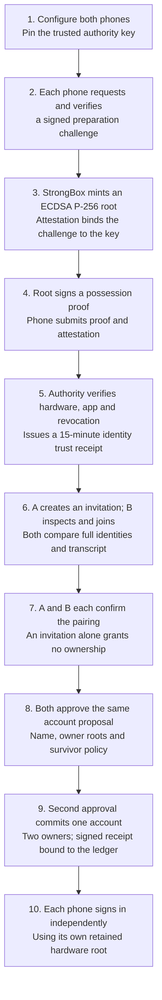
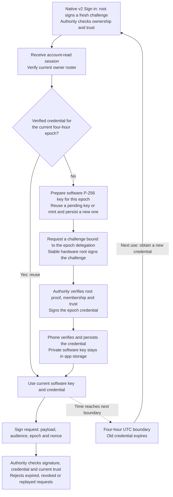
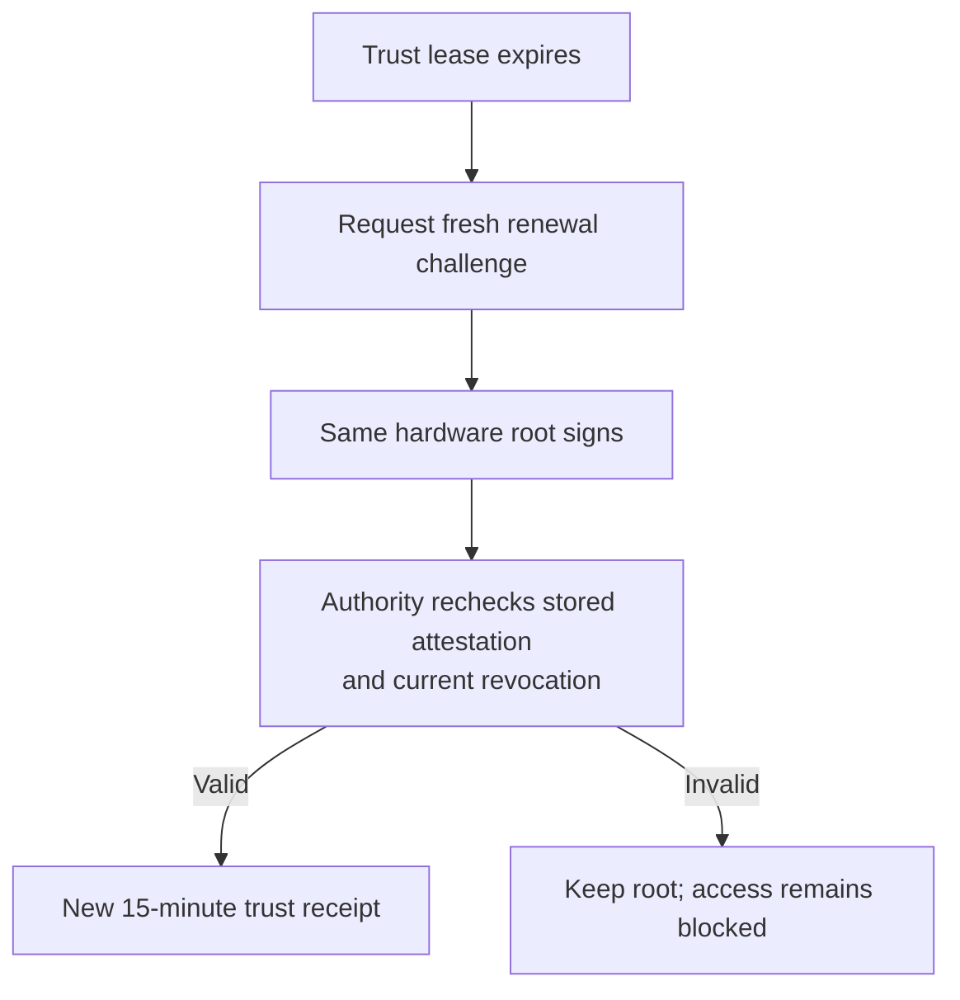
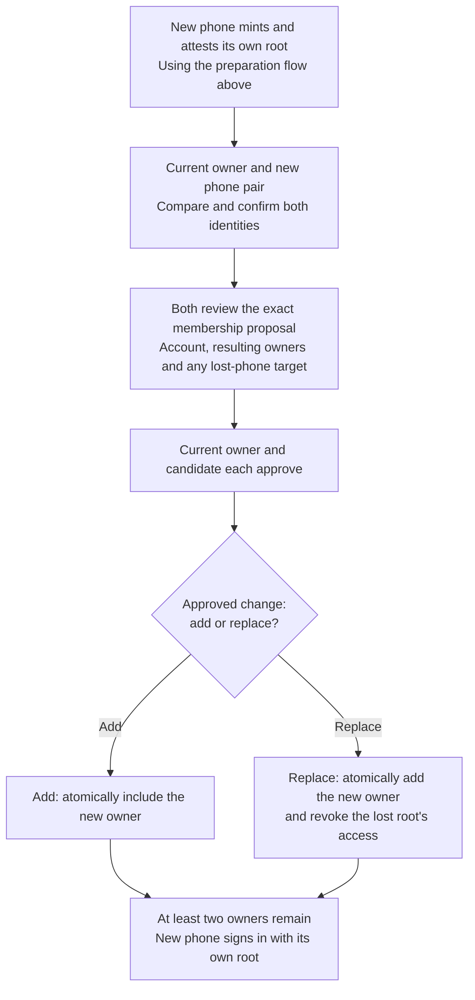

# SwiftKey protocol overview

**SwiftKey creates a non-exportable ECDSA P-256 signing key inside each compatible Android
phone's StrongBox secure hardware.** That key proves the phone's identity without
sending its private key to the server. It authorizes a separate P-256 software
signing key for a **four-hour epoch**, so routine requests can use a short-lived
credential while the long-lived identity remains in hardware.

Two phones become independent owners of one account. Each keeps its own hardware
key; they never copy or share a private key. You compare the phones, confirm the
pairing on both, and approve the same account and owner list on both. Only then
does the Swift/Vapor authority create the account. Each phone signs in separately
and receives its own epoch credential.

This provides hardware-backed proof of possession for applications that integrate
SwiftKey. **It is a custom authentication protocol, not a FIDO2/WebAuthn security
key or a drop-in passkey for existing websites.** The current implementation uses
Android StrongBox; an iPhone Secure Enclave implementation is not available yet.

## From new phones to account owners

Preparation runs independently on each phone. Each root stays inside that
phone's StrongBox; neither phone receives the other's private key.

1. **Prepare each phone.** The phone creates its hardware root and supplies
   attestation evidence plus proof that it holds the key. The authority checks
   the hardware/verified-boot policy, app identity, certificate chain and current
   revocation data before admitting it. The app pins the authority's public key
   through a trusted configuration channel, independently of any invitation.
2. **Pair the phones.** A short-lived QR code or link opens an invitation. Both
   phones show the authority, identities, full root fingerprints and the same
   transcript hash/comparison code. Each owner explicitly confirms those details.
   Importing a link alone never grants ownership.
3. **Create the account together.** Both phones review the same account name,
   owner set and ownership policy. One approval leaves the account uncreated.
   The second matching approval commits both owners atomically and produces a
   signed receipt bound to the authority's hash-linked ledger.
4. **Sign in and obtain a signing credential.** Each phone independently signs a
   fresh account- and origin-bound challenge with its hardware root. The authority
   checks current membership and trust, then verifies the root's authorization of
   that phone's epoch public key and signs the resulting credential.
5. **Verify requests online.** The authority checks the credential, signature,
   intended audience, current ownership/trust, expiry and replay state. A valid
   signature alone is insufficient if its owner has been removed or the request
   has expired or already been used.

## What rotates

The hardware root remains stable. The delegated **software** key changes on the
next use after a fixed four-hour UTC epoch boundary; there is no daily root-key
replacement or background rotation timer. A credential issued just before a
boundary has only the remainder of that epoch to live.

The root uses ECDSA P-256 with SHA-256. Delegated signing keys also use P-256 and
are stored in private app storage, outside StrongBox. This limits their credential
lifetime; it does not make a compromised running phone trustworthy. The current
signer does not require a fingerprint, PIN or physical touch for every signature.

For native v2 sign-in, an expired identity lease must first be explicitly
[renewed with the same hardware root](#renewing-hardware-trust).

Epoch boundaries are **00:00, 04:00, 08:00, 12:00, 16:00 and 20:00 UTC**.
Rotation links the new delegation to the previous public-key hash. The final
loop runs on demand; the hardware root is unchanged. An account-read session
and an epoch signing credential are separate authorizations.

## Renewing hardware trust

The identity's 15-minute trust lease is separate from the four-hour signing
epoch. Renewal rechecks retained evidence; it does not mint a new hardware key.

## Losing or adding a phone

The implemented `two-owner-survivor-v1` policy keeps at least two owners. A current
owner and a new phone must both approve the exact membership change. Replacement
adds the new owner and revokes the lost owner's access in one atomic commit;
keys are never restored onto another phone.

Any current owner can start that replacement. This makes recovery possible with
one surviving phone, but a compromised owner can also take over the account. If
all owners are lost, there is no administrative recovery or password reset.

See the [full pairing and ownership protocol](PAIRING-ACCOUNT-PROTOCOL.md)
and [cryptographic protocol](../PROTOCOL.md) for the wire formats and trust model.

## Hardware verification and remaining work

The current Android build passed a real two-phone run against an isolated Vapor
authority: **StrongBox admission, mutual pairing, two-owner account creation, and
separate sign-ins producing two independently verified epoch credentials**. The
Pixel and Xiaomi retained their original hardware roots. The first account
approval created nothing; the second committed exactly one account with two owners.
See the [hardware evidence](../artifacts/phone-v2-hardware/README.md).

That run used native Copy link and manual import. Optical QR scanning, interrupted
v2 ceremonies and owner replacement still need physical acceptance. The older
installed workload app separately passed Vapor signing, replay rejection and
restart checks; the current v2 phone UI does not expose workload submission.
Standalone owner revocation, arbitrary policy changes, browser-login grants,
legacy-account upgrade and iOS remain unavailable. This is a development project,
with no production authority cutover claimed.

See [phone setup](PHONE-V2-BUILD.md) and the [server guide](../SwiftKeyServer/README.md) for configuration.
